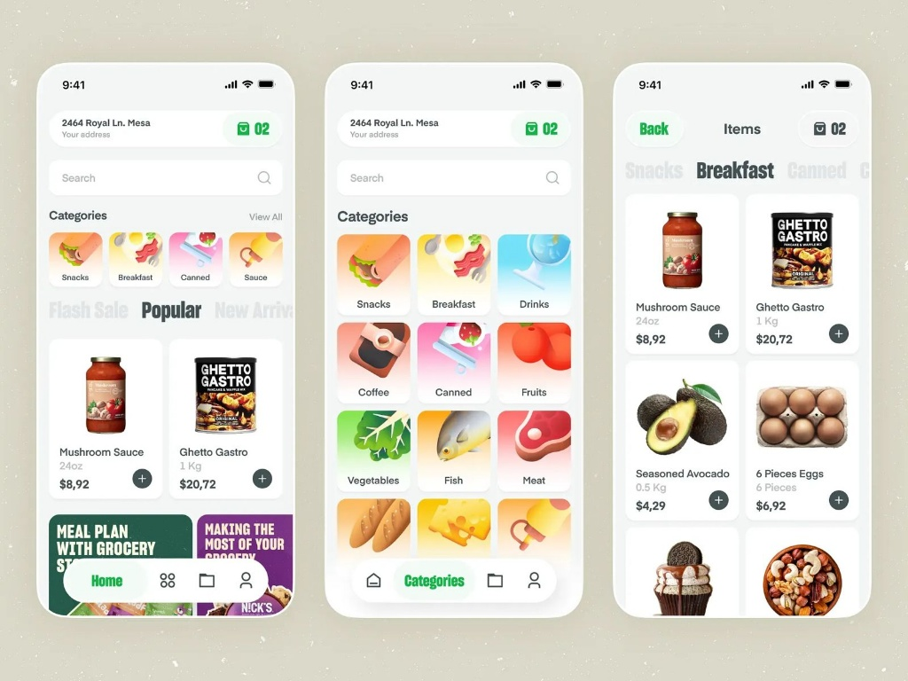

# Grocery UI (Freelance Project)

## Project Overview
This is a high fidelity grocery store frontend built with Flutter for a real client. The application features a dynamic category section that transitions between a single row and a full grid layout using smooth animations.

## Interface Preview

| Home Screen|
| :---|
|  | 

## Core Features
1. Animated Category Grid using AnimatedCrossFade
2. Custom Floating Navigation Bar with active state management
3. Responsive Product Grid with quick add functionality
4. Search bar implementation and category filtering logic

## Technical Stack
1. Framework Flutter
2. Language Dart
3. Design Pattern Stateful UI Architecture

## Setup Instructions
1. Clone the repository to your local machine
2. Run flutter pub get to install dependencies
3. Ensure assets are defined in pubspec.yaml
4. Execute flutter run on your emulator or device

